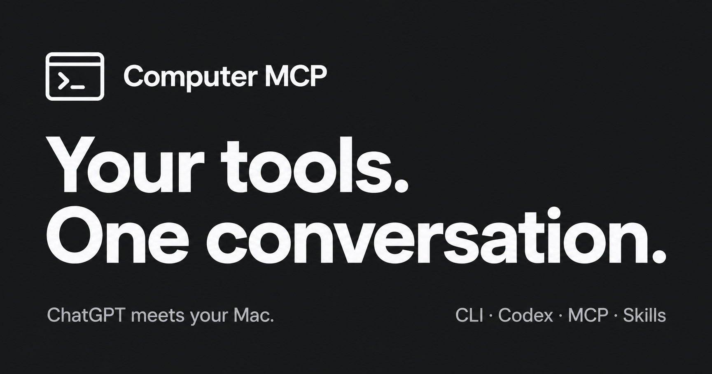

# Computer MCP

**Let ChatGPT use your local tools.**

Connect CLI tools, Codex, MCP servers and Skills to your conversations. Work
with local projects and files, run the tools on your Mac, and bring the results
back into the task—with permissions you choose.

[Get started](#quick-start) · [Product site](https://computer-mcp.github.io/) ·
[Documentation](Documentation/README.md) ·
[Latest release](https://github.com/computer-mcp/computer-mcp/releases/latest) ·
[简体中文](README.zh-CN.md)

- **Put your CLI tools to work.** Register commands or install a CLI plugin so
  ChatGPT can invoke exposed tools and read their results.
- **Code with Codex from your conversation.** Use the independent Codex plugin
  to start coding tasks, follow progress and inspect results.
- **Connect more with MCP and Skills.** Add MCP services and reusable instructions
  directly or together in a plugin package.
- **Choose the access.** Configure tools, workspaces and confirmation policy;
  review host actions requiring approval locally.

Computer MCP runs on macOS 14 or later and supports ChatGPT and other compatible
MCP clients. Tools need installation and configuration. Codex requires its
plugin and local Codex setup; advanced orchestration is experimental. Skills
provide instructions and resources, while execution uses authorized tools.

## The 30-second model

```text
ChatGPT · Codex · another MCP client
                 │
       authenticated connection
                 ▼
          Computer MCP.app
                 │
 caller → profile → registered workspace → policy → approval when required
                 │
                 ▼
 Builtin · Skills · CLI · MCP · AX fallback · Git · Shell
                 │
                 ▼
       local execution → bounded result → redacted audit receipt
```

Every call is tied to a caller, profile, capability, and—when relevant—a
registered workspace. Unknown tools, ungranted workspaces, unsafe paths, and
unsupported ownership claims fail closed.

## Plugins and direct integrations

A plugin is a package combining MCP, CLI and Skills contributions. Native MCP
servers and local CLI/Skill registrations can also be added directly; both
paths use the same host policy, workspace scope and audit.

Use the App's plugin management pages, or the owner CLI:

```sh
computer-mcp plugins search --refresh
computer-mcp plugins list
```

Official packages include [Codex](https://github.com/computer-mcp/plugin-codex),
[Computer Use](https://github.com/computer-mcp/plugin-computer-use) and
[Swift Format](https://github.com/computer-mcp/plugin-swift-format). Select a
release artifact to install, review its dependencies and tool exposure, then
enable it. Installation starts disabled and grants no permissions. Bundled
packages use the same lifecycle; external tools remain user/vendor-owned.

Codex execution lives in its independent MCP adapter. Upgrading an embedded
Codex configuration requires the explicit
[configuration and offline state migration](Documentation/Reference/CodexMigration.md).
Do not switch the backend currently performing the migration.
Native Computer Use also depends on vendor caller authentication, not just
macOS privacy grants; native AX tools remain available as fallback.

See [Plugin Packages](Documentation/Reference/PluginPackages.md) for installation,
upgrades and recovery, and [CLI Trees](Documentation/Reference/CLITrees.md) for
verified command projection and structured-coverage limits.

## What it enables

- Ask ChatGPT to inspect a local project, use connected research tools, and hand
  implementation work to Codex.
- Run a registered formatter, inspect a Git diff, or process files through
  authorized local commands, then use the result in the next step.
- Combine CLI commands, downstream MCP services and reusable Skills around a
  task through one gateway.
- Connect from ChatGPT through Secure MCP Tunnel or from a reviewed remote
  client through a Cloudflare named tunnel, subject to client and account support.
- Connect desktop operations through the Computer Use plugin or native AX tools,
  subject to operation-specific macOS permissions and vendor caller authentication.

## Choose what your agents can use

Computer MCP makes two separate decisions:

1. **Policy authorization:** Is this caller allowed to use this capability in
   this registered workspace at all?
2. **Action consent:** If host policy requires confirmation, has the local user
   approved this exact operation?

Approval never expands policy. A denied capability cannot become allowed just
because someone clicks Approve. `shell.run`, generic CLI execution, process
spawning, workspace writes, destructive operations, and Full Shell remain off
unless the active configuration grants the exact path. Credentials stay in the
signed App's macOS Data Protection Keychain; examples, diagnostics, logs, and
audit rows keep only placeholders or redacted summaries.

The optional Codex plugin follows Codex's own configuration and approval
model, including native Full Access defaults and explicit overrides. The host
decides who may invoke Codex. Calls from Codex back into Computer MCP tools
still require the corresponding host capabilities and local confirmation.
Selecting a workspace supplies an initial directory, not an OS sandbox for
native Full Access.

See [Security and Privacy](Documentation/Architecture/SecurityAndPrivacy.md) for
the complete trust model and [SECURITY.md](SECURITY.md) for reporting a
vulnerability.

## Capability status

| Status | Capability | Notes |
| --- | --- | --- |
| Stable | App-owned local gateway, workspace registration, profiles, policy, operation tickets, and redacted audit | Default product control plane on macOS 14+ |
| Stable | Local MCP, ChatGPT through OpenAI Secure MCP Tunnel, and Cloudflare named-tunnel connections | Each remote path has its own caller and profile boundary |
| Stable | Builtin, Skill, registered CLI, downstream MCP, Shell, and native AX fallback | Availability still depends on the selected profile, workspace, dependency, and macOS permission |
| Stable | Governed workspace and Git operations | Writes require policy; destructive atomics use reviewed single-use tickets; no implicit push |
| Stable | Plugin package lifecycle, direct/plugin MCP registration, verified CLI trees and Skills | Host grants remain separate; external dependencies are not installed automatically |
| Experimental | Codex plugin App Server and Exec provider paths | Opt-in, disabled by default, and dependent on an installed authenticated Codex |
| Experimental | Native Codex Goal passthrough, Computer MCP acceptance runs, deterministic thread handoff, bounded recent-thread supervision, and managed child worktrees | Official Goal state, Computer MCP acceptance, native Codex permissions, gateway capabilities, and external-client ownership have separate authorities |
| Planned | Broader platform support and more first-class UI for advanced orchestration | No committed release date; the current signed App is macOS-only |

Experimental does not mean unbounded: these paths use the same workspace,
policy, approval, lifecycle, resource-limit, and audit boundaries as stable
capabilities.

## ChatGPT orchestrates, Codex executes

A representative workflow looks like this:

1. ChatGPT calls Computer MCP to inspect a registered repository and gather
   local context.
2. Computer MCP binds the request to the ChatGPT profile and workspace; policy
   decides which read, Git, CLI, and Codex capabilities are available.
3. ChatGPT starts or steers a dedicated Codex task for that workspace.
4. Codex requests a governed host mutation. Computer MCP records its approval
   ticket when confirmation is required; the local user approves or denies it.
5. Codex edits and commits through the governed path. Computer MCP correlates
   the Codex request, approval, operation ticket, gateway invocation, Git
   result, and audit receipt.
6. A Computer MCP acceptance run stays active until its required build, test,
   and clean-worktree evidence is explicitly accepted. A finished turn alone
   does not complete the run.

This is optional orchestration, not a claim that Computer MCP is Codex Remote.

## Computer MCP and Codex Remote

Use **official Codex Remote** for the first-party experience of remotely
controlling ordinary Codex work. It owns that product surface and is the
preferred choice when Codex itself is the whole workflow.

Use **Computer MCP** when the workflow needs a general MCP-accessible local
execution plane: multiple AI clients, registered tools and applications,
workspace/profile policy, custom approval rules, correlated audit, or optional
Codex orchestration alongside other local capabilities.

The ownership modes remain explicit:

- a quick Codex thread or turn;
- a dedicated Computer MCP-owned Codex runtime;
- an official persisted Codex Goal;
- a separate Computer MCP acceptance run;
- official Codex Remote;
- an external Codex Desktop, IDE, or CLI session.

Computer MCP can release or stop only runtimes it verifiably owns. It can
deliberately try to resume a persisted thread, and it can explain a likely
writer conflict, but it never claims authority to terminate another
application's process or subscription.

## Quick start

Computer MCP requires macOS 14 or later.

1. Download the notarized Universal 2 DMG and `SHA256SUMS` from the
   [latest release](https://github.com/computer-mcp/computer-mcp/releases/latest).
2. Verify the checksum, drag **Computer MCP** to Applications, and open the
   installed App from Finder. macOS privacy grants belong to this signed App
   identity.
3. On Welcome, choose **Connect a local MCP client** and start the Gateway.
4. Copy the displayed stdio command into your client. Codex users can instead
   review and confirm **Register with Codex**.
5. Make the first read-only tool call:

   ```text
   workspace.list
   ```

6. Refresh Home. The connection becomes Verified only after a matching,
   successful audit event is observed.

Optionally install the bundled CLI from Home. It creates
`~/.local/bin/computer-mcp` without `sudo`. Check the same live readiness model
from a terminal:

```sh
computer-mcp doctor --journey local
computer-mcp doctor --journey local --json
```

Doctor exits 0 only for Ready or Verified. Its schema-1 JSON remains parseable
when the App is unavailable and never includes a credential value.

Continue with the [Quick Start](Documentation/Reference/QuickStart.md),
[ChatGPT runbook](Documentation/Reference/ChatGPTWebRunbook.md), or
[Cloudflare runbook](Documentation/Reference/CloudflareRunbook.md). Normal App
use does not require TOML.

## Architecture

The App owns the gateway, private control socket, registered workspace
bookmarks, profiles, provider and tunnel lifecycles, Keychain credentials, and
audit database. Local clients use an owner-only Unix-domain socket. ChatGPT
uses OpenAI Secure MCP Tunnel. Reviewed public MCP consumers can use a
loopback-only, bearer-protected origin behind a Cloudflare remotely managed
named tunnel.

The gateway then resolves the exact tool, binds caller/profile/workspace,
checks policy and any operation ticket, obtains action consent when needed,
dispatches one bounded adapter, and records the redacted outcome. Standalone
TOML modes are development and diagnostic surfaces; they do not share the
App's bookmarks or Keychain state.

Read the current architecture in [Gateway](Documentation/Architecture/Gateway.md),
[Runtime](Documentation/Architecture/Runtime.md), and
[Capability Ownership](Documentation/Architecture/Ownership.md). Exhaustive
commands and schemas belong in [Reference](Documentation/Reference/README.md).

## Codex operations and diagnosis

The optional Codex provider records owned runtime IDs, process groups,
connection generations, loaded threads, active turns, approvals, shutdown
reasons, and termination escalation. Durable ownership receipts allow a later
Computer MCP generation to validate a thread's workspace before attempting a
resume.

Operator commands expose the same evidence without requiring direct process or
open-file inspection:

```sh
computer-mcp codex diagnose-thread <thread-id> --workspace-id <workspace-id>
computer-mcp codex diagnostics --workspace-id <workspace-id>
computer-mcp codex release-thread <thread-id> --workspace-id <workspace-id>
computer-mcp codex recent-thread <thread-id> --workspace-id <workspace-id>
```

The diagnostic reports verified Computer MCP ownership separately from an
inferred external conflict and offers only safe actions such as releasing an
owned thread, stopping an exact owned runtime, reviewing stale receipts, or
trying to reclaim a persisted thread. Handoff succeeds only after no owned
runtime still claims the thread and another official client can immediately
claim the persisted thread. Long-running supervision reads a bounded recent
tail instead of loading the whole history. Codex's native permission settings
remain visible in the adapter's configuration and runtime diagnostics.

## Current limitations

- The signed product is macOS-only and requires macOS 14 or later.
- Remote setup depends on user-owned OpenAI or Cloudflare services and their
  current account, administrator, network, and availability constraints.
- Accessibility and Screen Recording must be granted to the installed signed
  App for capabilities that need them; other capabilities remain available.
- The advanced Codex provider is opt-in and depends on the installed official
  Codex version, authentication, and stable protocol support.
- Computer MCP cannot inspect, unsubscribe, or terminate an external Codex
  Desktop, IDE, CLI, or Remote connection it does not own.
- Native Codex Full Access runs with the current user's operating-system
  authority; it does not grant access to additional Computer MCP capabilities.
- Computer MCP does not silently select a workspace when more than one eligible
  workspace exists, does not implicitly push Git commits, and does not turn a
  normal completed turn into accepted Goal completion.
- A development build or ad-hoc-signed App is not an official release and does
  not inherit the installed release's macOS privacy or Keychain identity.

## Documentation map

- [Documentation home](Documentation/README.md)
- [Quick Start](Documentation/Reference/QuickStart.md)
- [CLI reference](Documentation/Reference/CLI.md)
- [Configuration reference](Documentation/Reference/Config.md)
- [Tool reference](Documentation/Reference/Tools.md)
- [Troubleshooting](Documentation/Reference/Troubleshooting.md)
- [Architecture](Documentation/Architecture/README.md)
- [Production acceptance contract](Documentation/Reference/ProductizationAcceptance.md)
- [Release process](Documentation/Reference/Release.md)

## Development and contributing

Inspect [Package.swift](Package.swift) before changing products or targets.
Build and test from the repository root:

```sh
swift-format lint --strict --recursive --configuration .swift-format Package.swift Sources Tests
/usr/bin/swift build
/usr/bin/swift test
```

For standalone development, use one explicit TOML file per process:

```sh
swift run computer-mcp serve stdio --config Examples/computer-mcp.toml
swift run computer-mcp config validate --config Examples/computer-mcp.toml
swift run computer-mcp tools list --config Examples/computer-mcp.toml
```

Standalone mode does not use App-owned bookmarks, database state, or Keychain
tunnel credentials and must not run as a second owner of the App's state. See
[Examples](Examples/README.md) and [CONTRIBUTING.md](CONTRIBUTING.md) before
opening a change.

Official releases come only from the protected signed-tag workflow. The
workflow builds, Developer ID signs, notarizes, staples, verifies, and creates
a draft GitHub Release; publishing remains a separate operator acceptance
step. See [Release Reference](Documentation/Reference/Release.md).

Computer MCP is available under the terms in [LICENSE](LICENSE).
